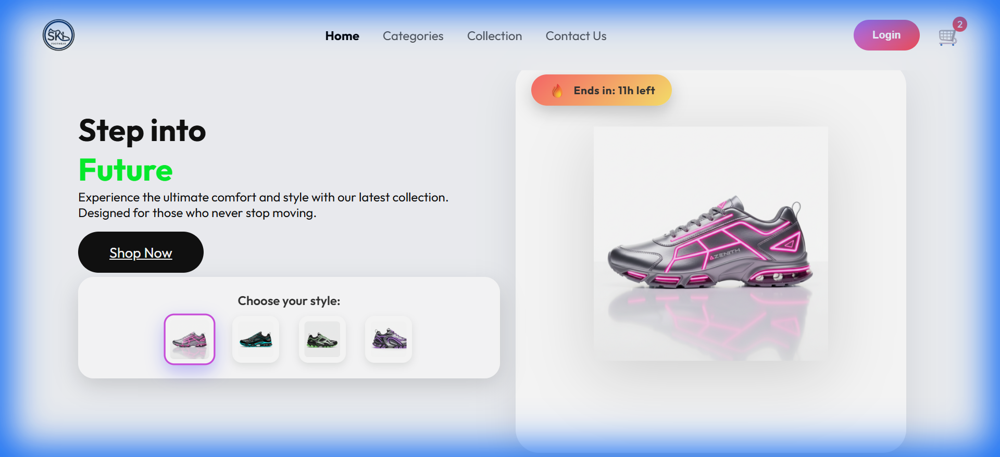

<div align="center">


# Sneakora

**A full-stack sneaker storefront — built with Next.js 14, Stripe, and Sanity.**

<br />

[](https://nextjs.org)
[](https://www.typescriptlang.org)
[](https://tailwindcss.com)
[](https://stripe.com)
[](https://sanity.io)
[](https://prisma.io)
[](https://vercel.com)

<br />



</div>

<br />

---

## Overview

Sneakora is an e-commerce store for sneakers. It handles the full shopping flow — browsing, cart, Stripe checkout, order tracking — with a Sanity-powered blog and a complete admin panel for managing products, orders, and users.

---

## Tech Stack

<table>
  <tr>
    <td><strong>Frontend</strong></td>
    <td>Next.js 14 (App Router), React, TypeScript</td>
  </tr>
  <tr>
    <td><strong>Styling</strong></td>
    <td>Tailwind CSS v4, shadcn/ui, Framer Motion, Three.js</td>
  </tr>
  <tr>
    <td><strong>Auth</strong></td>
    <td>BetterAuth — email/password, Google OAuth, GitHub OAuth</td>
  </tr>
  <tr>
    <td><strong>Database</strong></td>
    <td>Neon (serverless PostgreSQL) via Prisma ORM</td>
  </tr>
  <tr>
    <td><strong>Payments</strong></td>
    <td>Stripe (checkout sessions + webhooks)</td>
  </tr>
  <tr>
    <td><strong>CMS</strong></td>
    <td>Sanity (blog content)</td>
  </tr>
  <tr>
    <td><strong>Email</strong></td>
    <td>Resend + React Email</td>
  </tr>
  <tr>
    <td><strong>Validation</strong></td>
    <td>Zod</td>
  </tr>
  <tr>
    <td><strong>Analytics</strong></td>
    <td>Recharts (admin dashboard)</td>
  </tr>
  <tr>
    <td><strong>Testing</strong></td>
    <td>Playwright (E2E)</td>
  </tr>
</table>

---

## Features

<details>
<summary><strong>Shopping</strong></summary>
<br />

- Product catalog with category, filter, and sort
- Product detail pages with image gallery
- Shopping cart with quantity management
- Wishlist and recently viewed products
- Coupon and discount code support at checkout
- Stripe-powered checkout with webhook order fulfillment

</details>

<details>
<summary><strong>Authentication</strong></summary>
<br />

- Email/password sign-up with email verification
- Google and GitHub OAuth via BetterAuth
- Role-based access control: `user` and `admin`
- Protected routes enforced via Next.js middleware

</details>

<details>
<summary><strong>Admin Panel</strong></summary>
<br />

- Product CRUD with image uploads
- Order management and status updates
- User management and role assignment
- Coupon creation with expiry and usage limits
- Sales analytics dashboard with charts

</details>

<details>
<summary><strong>Content & Other</strong></summary>
<br />

- Blog powered by Sanity CMS with draft mode
- Newsletter subscriptions
- Contact form
- AI-assisted product search (RAG)
- Transactional emails via React Email + Resend

</details>

---

## Project Structure

```
src/
├── app/
│   ├── (auth)/          # Sign-in, sign-up, onboarding
│   ├── admin/           # Admin dashboard and management pages
│   ├── api/             # Route handlers
│   │   ├── auth/        # BetterAuth endpoints
│   │   ├── products/    # Product CRUD
│   │   ├── cart/        # Cart operations
│   │   ├── checkout/    # Stripe checkout sessions
│   │   ├── orders/      # Order management
│   │   ├── reviews/     # Product reviews
│   │   ├── wishlist/    # Wishlist
│   │   ├── blog/        # Blog posts
│   │   ├── coupons/     # Coupon validation
│   │   ├── webhooks/    # Stripe webhooks
│   │   └── rag/         # AI product search
│   ├── shop/            # Product catalog and detail pages
│   ├── cart/            # Cart page
│   ├── checkout/        # Checkout flow
│   ├── profile/         # User profile and order history
│   ├── wishlist/        # Wishlist page
│   ├── blog/            # Blog listing and post pages
│   ├── about/           # About page
│   └── contact/         # Contact form
├── components/          # UI components
├── emails/              # React Email templates
├── lib/                 # Auth, DB, and utility configs
└── hooks/               # Custom React hooks

prisma/
├── schema.prisma        # Database schema
├── seed.ts              # Seed script
└── migrations/          # Migration history

tests/
└── e2e/                 # Playwright end-to-end tests
```

---

## Getting Started

### Prerequisites

- Node.js 18+
- [Neon](https://neon.tech) PostgreSQL database
- [Stripe](https://stripe.com) account
- [Sanity](https://sanity.io) project
- [Resend](https://resend.com) API key

### 1. Clone and install

```bash
git clone https://github.com/SARAMALI15792/Sneakora_tec.git
cd Sneakora_tec
npm install
```

### 2. Configure environment variables

```bash
cp .env.example .env.local
```

Fill in `.env.local`:

```env
# Database
DATABASE_URL=""

# BetterAuth
BETTER_AUTH_SECRET=""
BETTER_AUTH_URL="http://localhost:3000"
AUTH_GOOGLE_ID=""
AUTH_GOOGLE_SECRET=""
AUTH_GITHUB_ID=""
AUTH_GITHUB_SECRET=""

# Stripe
STRIPE_SECRET_KEY=""
NEXT_PUBLIC_STRIPE_PUBLISHABLE_KEY=""
STRIPE_WEBHOOK_SECRET=""

# Sanity
NEXT_PUBLIC_SANITY_PROJECT_ID=""
NEXT_PUBLIC_SANITY_DATASET=""
SANITY_API_TOKEN=""

# Email
RESEND_API_KEY=""
```

### 3. Set up the database

```bash
npx prisma migrate dev
npx prisma db seed
```

### 4. Start the dev server

```bash
npm run dev
```

Open [http://localhost:3000](http://localhost:3000).

---

## Scripts

| Command | Description |
|---|---|
| `npm run dev` | Start development server |
| `npm run build` | Production build |
| `npm run start` | Start production server |
| `npm run lint` | Run ESLint |
| `npm run db:migrate` | Run Prisma migrations |
| `npm run db:push` | Push schema without migration |
| `npm run db:seed` | Seed the database |
| `npm run db:studio` | Open Prisma Studio |
| `npm run email:dev` | Preview email templates locally |

---

<div align="center">

Made with Next.js · Deployed on Vercel

</div>
